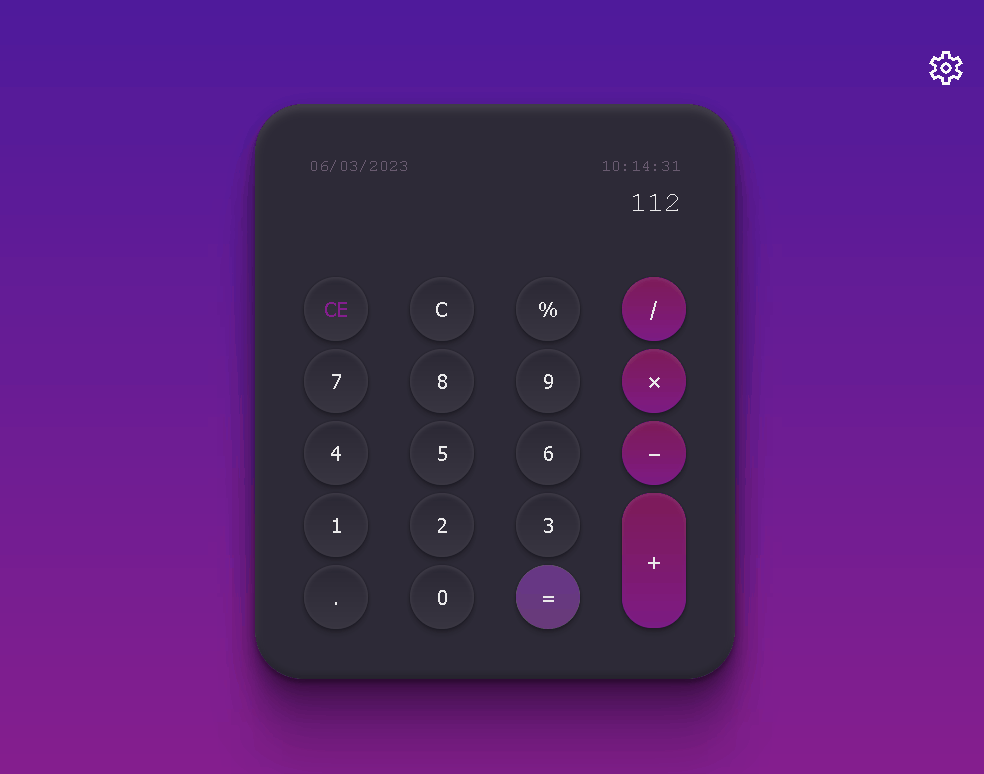
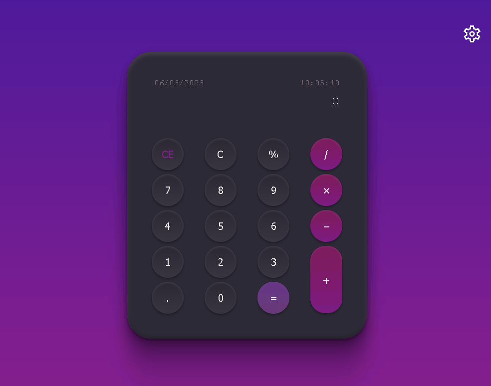
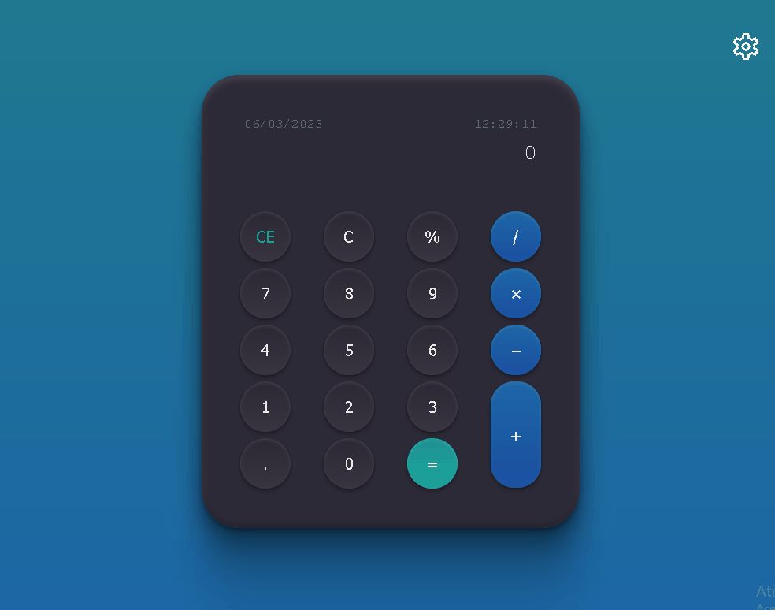

# calculator
 
## Personalizando o Tema

você pode personalizar a aparência do site escolhendo um tema diferente. Basta clicar no botão de alternância de tema e selecionar a opção desejada. O tema escolhido será salvo e carregado automaticamente na próxima vez que você visitar o site.

---

## Funcionalidades: Repetindo Operações com o Botão ‘=’

Se a última operação foi '2 + 3 =' e o visor mostra '5', você pode repetir a operação de adição pressionando '=' novamente. Isso adicionará '3' ao resultado atual e exibirá '8'. Se você pressionar ‘=’ novamente, ele adicionará mais 3 e exibirá ‘11’ e assim por diante.” 

*Exemplo* 

Se você inserir ‘2 + 3 +’ e o visor mostrar ‘5’, você pode continuar adicionando 5 ao resultado atual pressionando o botão ‘=’. Por exemplo, se você pressionar ‘=’ novamente após inserir ‘2 + 3 +’, o visor mostrará ‘10’. Se você pressionar ‘=’ mais uma vez, ele adicionará mais 5 ao resultado atual e exibirá ‘15’. Você pode continuar pressionando ‘=’ para adicionar 5 ao resultado atual repetidamente.”

---

## Tecnologias

- CSS
- HTML
- JavaScript
